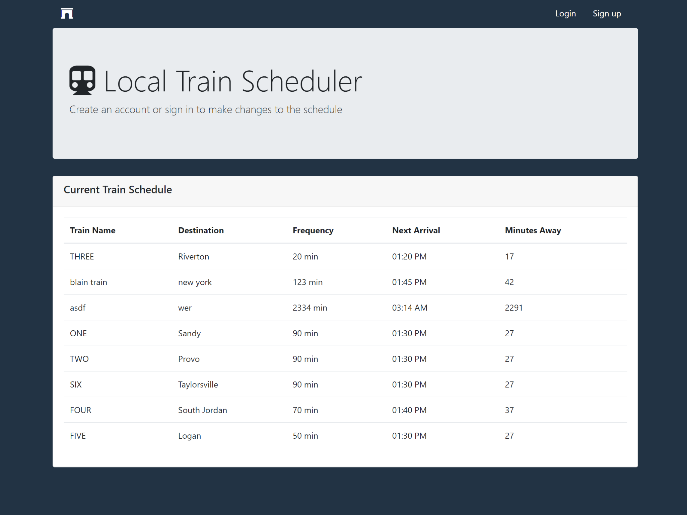
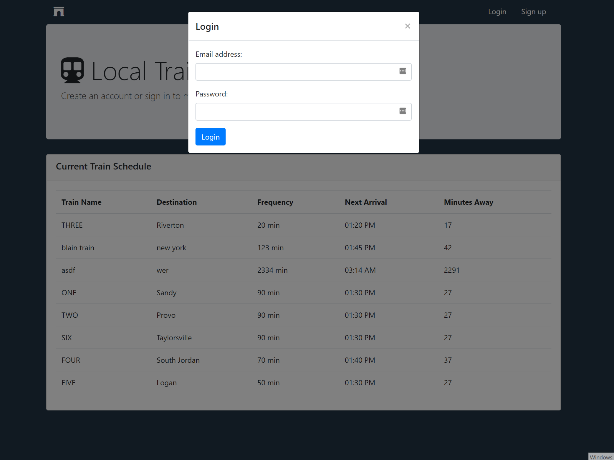
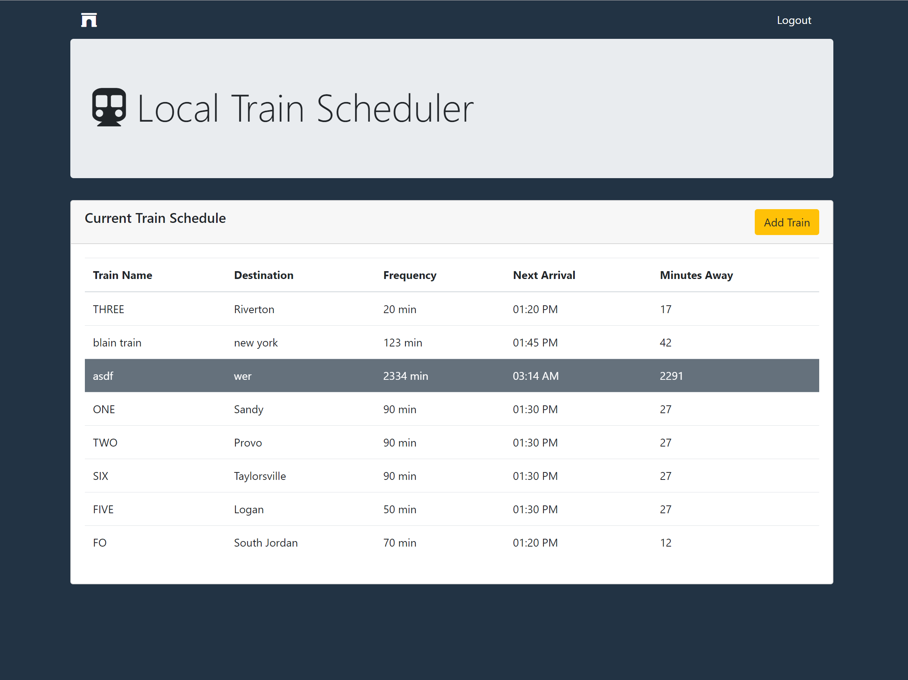
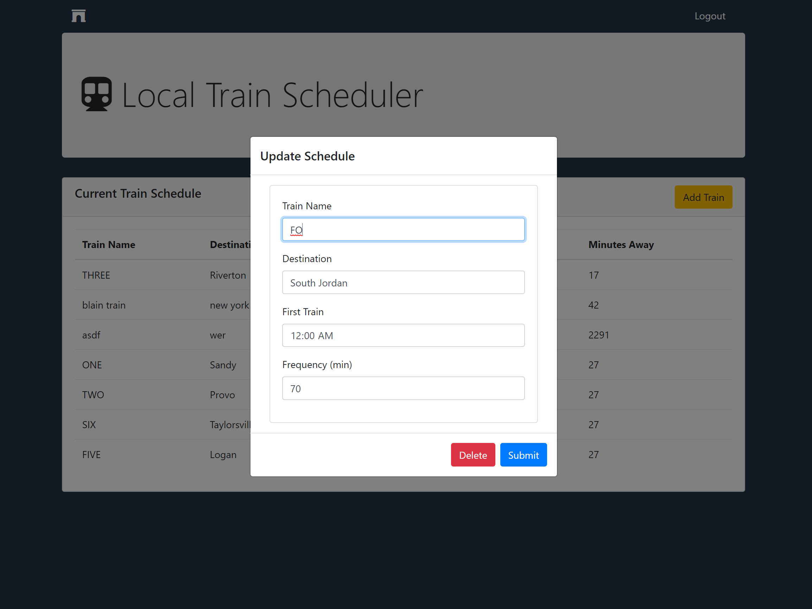

# Train-Scheduler

https://jessibramwell.github.io/Train-Scheduler/

### Overview 

The Train-Scheduler project was an introduction to Googles Firebase Database and Firebase Authentication. It allows you to create an account or sign into an existing account. After a user has signed in they are able to add a train to the train schedule, and edit or delete items on the current list. 

* Create an account with an email and password to make changes to the schedule
* Add a new train with the "Add Train" button or edit an existing one by double clicking on an item from the list. 
* Submit your changes and see them updated on the list

It was built using bootstrap and utilizes momentjs to calculate train arrival times.

Challenges included determining how to calculate arrival times and making changes to the data when data was edited or deleted. 

